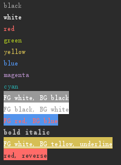

# colored_text
print colored text on the console



[ANSI](https://zh.wikipedia.org/wiki/ANSI%E8%BD%AC%E4%B9%89%E5%BA%8F%E5%88%97)


```
PRINT.PN("black", PRINT.BLACK);
PRINT.PN("white", PRINT.WHITE);
PRINT.PN("red", PRINT.RED);
PRINT.PN("green", PRINT.GREEN);
PRINT.PN("yellow", PRINT.YELLOW);
PRINT.PN("blue", PRINT.BLUE);
PRINT.PN("magenta", PRINT.MAGENTA);
PRINT.PN("cyan", PRINT.CYAN);
PRINT.PN("FG white, BG black", PRINT.WHITE, PRINT.BLACK_BACKGROUND);
PRINT.PN("FG black, BG white", PRINT.BLACK, PRINT.WHITE_BACKGROUND);
PRINT.PN("FG red, BG blue", PRINT.RED, PRINT.BLUE_BACKGROUND);
PRINT.PN("bold italic", PRINT.BOLD, PRINT.ITATIC);
PRINT.PN("FG white, BG tellow, underline", PRINT.WHITE, PRINT.YELLOW_BACKGROUND, PRINT.UNDERLINE);
PRINT.PN("red, reverse", PRINT.RED, PRINT.REVERSE);
```

